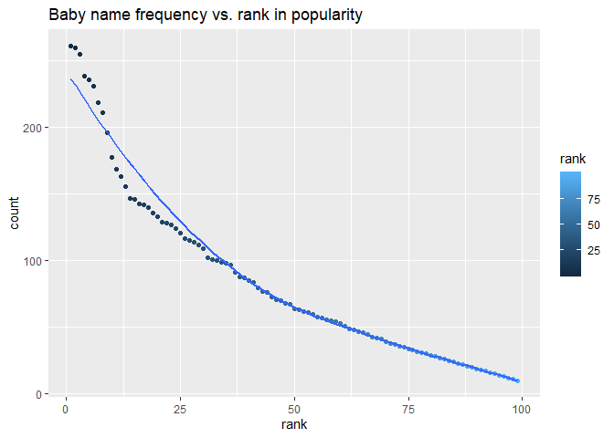

p8105\_hw2\_ilz2105
================
Lulu Zhang
2019-09-29

|               |
| ------------- |
| **Problem 1** |

``` r
library(tidyverse)
library(readxl)
library(tidyr)
library(dplyr)
library(ggridges)
```

### Import Mr. Trash Wheel dataset & clean sheets

Below I imported the `Mr. Trash Wheel` dataset and specified the sheets:
`Mr Trash Wheel`, `2017 Precipitation`, and `2018 Precipitation`. For
the `mrtrashwheel` sheet, I omitted rows that did not contain `Dumpster`
specific data and non-data entries. The number of `Sports Balls` was
rounded to the nearest integer and converted to an integer variable
using `as.integer`.

``` r
# read and clean Mr. Trash Wheel sheet
mrtrashwheel = read_excel("./Trash-Wheel-Collection-Totals-8-6-19.xlsx", 1, col_names = TRUE) %>% 
  janitor::clean_names() %>% 
drop_na(dumpster) %>% 
mutate(sports_balls = round(sports_balls, digits = 0)) %>%  
mutate(sports_balls = as.integer(sports_balls))
```

Next, I read and cleaned the precipitation data for the `2018
Precipitation` and `2017 Precipitation` sheets. For each, I omitted rows
without precipitation data and added a variable `year`. Then I combined
the precipitation datasets and converted `month` to a character
variable.

``` r
# read and clean 2018 precipitation data
mrtrash_data_2018 = read_excel("./HealthyHarborWaterWheelTotals2018-7-28.xlsx", sheet = "2018 Precipitation", skip = 1 ) %>% 
  janitor::clean_names() %>%
  drop_na() %>% 
mutate(year = as.numeric(2018))

# Read and clean 2017 precipitation data
mrtrash_data_2017 = read_excel("./HealthyHarborWaterWheelTotals2018-7-28.xlsx", sheet = "2017 Precipitation", na = "NA" , skip = 1) %>% 
  janitor::clean_names() %>%
  #select(-precipitation_in, x2) %>% 
  drop_na() %>% 
  mutate(year = as.numeric(2017))


# combine precipitation datasets
# convert month to character variable
precipitation_data = bind_rows(mrtrash_data_2017, mrtrash_data_2018)  %>% 
  janitor::clean_names() %>% 
mutate(month = as.numeric(month),
       month = month.name[month])

# or 

both_precipitation = full_join(mrtrash_data_2017, mrtrash_data_2018, 
                               by = c("month", "total", "year")) %>% 
  janitor::clean_names() %>% 
mutate(month = as.numeric(month),
       month = month.name[month])
```

The number of observations for the `mrtrashwheel` sheet was 344, and 19
in the `both_precipitation` dataset. The `mrtrash_data_2018` had 7
observations, and the `mrtrash_data_2017` had `rnrow(mrtrash_data_2017)`
observations. The total precipitation in 2018 was 23.5 inches. The total
amount of precipitation is 2017 was 32.93 inches. The median number of
sports balls in a dumpster in 2017 was 8. Some key variables in the
sheets are `year` and `month` because those are the variables we joined
by when merging `mrtrash_data2018` and `mrtrash_data_2018` to create
`both_precipitation`.

|               |
| ------------- |
| **Problem 2** |

### Read and tidy `pols`, `snp`, and `unemployment` data and merge

First, clean the data in `pols-month.csv`. Use separate() to break up
the variable mon into integer variables `year`, `month`, and `day`;
replace `month number` with `month name`; create a `president` variable
taking values `gop` and `dem`, and remove `prez_dem` and `prez_gop`; and
remove the `day` variable.

``` r
# import pols-month.csv and clean
pols = read.csv("./fivethirtyeight_datasets/pols-month.csv") %>% 
  janitor::clean_names() %>% 
  separate(mon, into = c("year", "month", "day")) %>% 
  mutate(month = as.numeric(month),
       month = month.name[month],
  prez_gop = recode(prez_gop, '1' = "gop" ,  '2' = "gop" ,  '0' = "dem" ),
   president = prez_gop
  #year = as.numeric(year)
  )%>% 
  select(-prez_dem, -prez_gop, -day)
```

Second, clean the data in `snp.csv` using a similar process to the
above. For consistency across datasets, arrange according to `year` and
`month`, and organize so that `year` and `month` are the leading
columns.

``` r
# import snp.csv and clean
snp = read.csv("./fivethirtyeight_datasets/snp.csv") %>% 
  janitor::clean_names() %>% 
separate(date, into = c("month","day", "year" )) %>% 
  select(starts_with("year"), everything(), -day)  %>% 
  mutate(month = month.name[as.numeric(month)]) 
```

Third, I tidied the `unemployment` data so that it can be merged with
the previous datasets. This process involved switching from “wide” to
“long” format; ensuring that key variables have the same name; and
ensuring that key variables take the same values.

``` r
# import and tidy unemployment data 
# switch from 'wide' to 'long' format
unemployment = read.csv("./fivethirtyeight_datasets/unemployment.csv")  %>% 
   pivot_longer(Jan:Dec, names_to = "month", values_to = "percent") %>% 
  mutate(month = match(month, month.abb),
                       month = month.name[month]) %>% 
  janitor::clean_names()
```

Next, I joined the datasets by merging `snp` into `pols`, and merging
`unemployment` into the result.

``` r
# merge pols, snp, and unemployment
final = inner_join(snp, pols, by = c("year", "month")) %>% 
  janitor::clean_names() %>% 
  merge( unemployment, by = c("year", "month"))
```

Write a short paragraph about these datasets. Explain briefly what each
dataset contained, and describe the resulting dataset (e.g. give the
dimension, range of years, and names of key variables).

The `pols` dataset contained information about the number of national
politicians who are `dem` or `rep` at any given time. The data also
contained info about the number of `dem` or `gop` senators, govenors, or
representatives on the associated `date`. For example, in `march`
`1947`, there are 23 republican govenors and 51 republican senators,
which we see by looking at the `gov_gop` and `sen_gop` columns
respectively for that `month` and `year`. `pols` has 822 observations,
with `year` ranging from 1947, 2015.

The `snp` dataset contains 787 observations with 3 variables, `year`,
`month`, and `close`, which is the S\&P stock market index associated
with that date. The range of years is 1950, 2015.

The `unemployment` dataset contains 816 rows and 3 variables. The
`percent` column tells you the unemployment percentage for that
associated `month` and `year`. So in June of 1948, the unemployment
precentage was 3.6. The range of years for this data os 1948, 2015.

Fianlly, I merged `pols`, `snp`, and `unemployment` to create `final`,
which contains 786 observations and 11 variables. The range of years is
1948, 2015 and it tells us the unemployment percentage in the `percent`
column, S\&P stock market index in the `close` column, and number of dem
and rep senators/govenors/representatives for the given `month` and
`year` in the `gov_gop`, `sen_gop`, `rep_gop`, `sen_dem`, `gov_dem`, and
it tells us whether the `president` was dem or rep for the associated
`year` and `month` in the `presient` column.

|               |
| ------------- |
| **Problem 3** |

### Import `Popular_Baby_Names` dataset, tidy, and manipulate

Load and tidy the data. Note that, although these data may seem fairly
well formatted initially, the names of a categorical predictor and the
case structure of string variables changed over time; you’ll need to
address this in your data cleaning. Also, some rows seem duplicated, and
these will need to be removed (hint: google something like “dplyr remove
duplicate rows” to get started).

``` r
#load baby names dataset and tidy
  #recode ethnicity and check all variables
 #name to all lowercase
baby_names = read_csv("./Popular_Baby_Names.csv") %>% 
  janitor::clean_names() %>% 
  rename("year" = year_of_birth, "name" = childs_first_name) %>% 
  mutate(
    ethnicity = recode(ethnicity, 
                     'ASIAN AND PACI' = "ASIAN AND PACIFIC ISLANDER",  
                     'BLACK NON HISP' = "BLACK NON HISPANIC", 
                     'WHITE NON HISP' = "WHITE NON HISPANIC" )) %>% 
  mutate(name = str_to_lower(name)) %>% 
  distinct() 
```

    ## Parsed with column specification:
    ## cols(
    ##   `Year of Birth` = col_double(),
    ##   Gender = col_character(),
    ##   Ethnicity = col_character(),
    ##   `Child's First Name` = col_character(),
    ##   Count = col_double(),
    ##   Rank = col_double()
    ## )

Produce a well-structured, reader-friendly table showing the rank in
popularity of the name “Olivia” as a female baby name over time; this
should have rows for ethnicities and columns for year. Produce a similar
table showing the most popular name among male children over time.

``` r
#table showing rank in popularity of the name 'Olivia" 
olivia = baby_names %>% 
  filter(name == "olivia") %>% 
  select("year", "ethnicity", "rank") %>% 
  pivot_wider(names_from = "year", values_from = "rank") %>% 
  knitr::kable(digits = 1)
olivia
```

| ethnicity                  | 2016 | 2015 | 2014 | 2013 | 2012 | 2011 |
| :------------------------- | ---: | ---: | ---: | ---: | ---: | ---: |
| ASIAN AND PACIFIC ISLANDER |    1 |    1 |    1 |    3 |    3 |    4 |
| BLACK NON HISPANIC         |    8 |    4 |    8 |    6 |    8 |   10 |
| HISPANIC                   |   13 |   16 |   16 |   22 |   22 |   18 |
| WHITE NON HISPANIC         |    1 |    1 |    1 |    1 |    4 |    2 |

``` r
# table to find male baby name with the highest rank
popular_male_name = baby_names %>%
  filter(gender == "MALE") %>%
  filter(rank == 1) %>% 
  select(everything(), -"count") %>% 
  pivot_wider(names_from = "year", values_from = "name") %>% 
  knitr::kable(digits = 1)
popular_male_name
```

| gender     | ethnicity                      |     rank | 2016      | 2015       | 2014      | 2013       | 2012       | 2011                          |
| :--------- | :----------------------------- | -------: | :-------- | :--------- | :-------- | :--------- | :--------- | :---------------------------- |
| MALE       | ASIAN AND PACIFIC ISLANDER     |        1 | ethan     | jayden     | jayden    | jayden     | ryan       | ethan                         |
| MALE       | BLACK NON HISPANIC             |        1 | noah      | noah       | ethan     | ethan      | jayden     | jayden                        |
| MALE       | HISPANIC                       |        1 | liam      | liam       | liam      | jayden     | jayden     | jayden                        |
| MALE       | WHITE NON HISPANIC             |        1 | joseph    | david      | joseph    | david      | joseph     | michael                       |
| The table  | `olivia` shows us the freque   |   ncy of | the name  | for \`year | `and`et   | hnicity\`. | The rows   | show the `ethnicity`          |
| and colum  | ns are `year`.                 |          |           |            |           |            |            |                               |
| The table  | `popular_male_name` shows us   |    which | male baby | name was   | the most  | popular    | among \`et | hnicity`and by`year\`.        |
| It appear  | s that `jayden`, `ethan`, \`li | am\`, ar | e teh mos | t popular  | as they   | were rank  | ed 1 the   | most among the different      |
| ethniciti  | es and for multiple years. \`j |  ayden\` | was ranke | d 1 multi  | ples year | s for \`as | ian and p  | acific islander\`,            |
| \`black no | n hispanic`, and`hispanic\`.   |  `ethan` | was also  | ranked 1   | for mult  | iple year  | s among \` | asian and pacific islander\`, |
| nd \`black | non hispanic\`.                |          |           |            |           |            |            |                               |

### Scatterplot names for male, non hispanic children born in 2016

Finally, for male, white non-hispanic children born in 2016, produce a
scatter plot showing the number of children with a name (y axis) against
the rank in popularity of that name (x axis).

``` r
plot = baby_names %>% 
  filter( gender == "MALE", 
          ethnicity == "WHITE NON HISPANIC", 
          year == 2016) %>% 
ggplot(aes(x = rank, y = count, col= rank)) +
  geom_point() +
   geom_smooth(se = FALSE) +
  ggtitle("Baby name frequency vs. rank in popularity")

plot
```

<!-- -->

The plot `Baby name frequency vs. rank in popularity` shows the number
of children with a name (`count`) against the rank in popularity of that
name (`rank`) for male, non-hispanic children born in 2016. We can see
that as the rank in popularity of that name decreases, the number of
children with that name also decreases, suggesting a somewhat linear
relationship.
